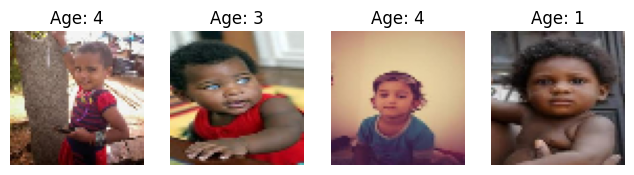

# Age Prediction App

## Overview

Welcome to the Age Prediction App! This sleek Streamlit application provides a seamless experience for predicting a person's age from an image. Simply upload your image and receive an accurate age estimate in real-time.



## Features

- **Effortless Image Upload:** Supports common formats such as JPEG and PNG.
- **Accurate Age Prediction:** Utilizes an advanced deep learning model to estimate the age of individuals in the image.
- **Instant Results:** Experience real-time predictions right in your web browser.

## Installation

1. **Clone the Repository:**
   ```bash
   git clone https://gitlab.com/niladridas/age-prediction-app.git
   cd age-prediction-app
   ```

2. **Create a Virtual Environment (Recommended):**
   ```bash
   python3 -m venv .venv
   source .venv/bin/activate
   ```

3. **Install Dependencies:**
   ```bash
   pip install -r requirements.txt
   ```

## Usage

1. **Train the Model (If Needed):**
   - Navigate to the `src` directory: `cd src`
   - Run the training script: `python train.py`
   - The trained model will be saved in the `saved_models` directory.

2. **Launch the Streamlit App:**
   ```bash
   streamlit run app/app.py 
   ```

3. **Access the App:**
   - Streamlit will start a development server.
   - Open the provided local URL (usually `http://localhost:8501/`) in your web browser.

## Project Structure

```
age-prediction-app/
  ├── app/             # Streamlit app code
  │   └── app.py
  ├── data/            # Data directory
  │   ├── raw/         # Raw image data (optional)
  │   └── processed/   # Processed training/testing data
  ├── saved_models/    # Trained model files
  ├── src/             # Python scripts for training and other tasks
  │   └── train.py     # Model training script
  ├── requirements.txt # Project dependencies
  └── README.md        # This file
```

## Dataset

- **UTKFace:** A comprehensive face dataset featuring a wide age range (0-116 years). It includes over 20,000 face images with annotations for age, gender, and ethnicity, encompassing diverse poses, expressions, lighting conditions, and more. This dataset is ideal for various tasks such as face detection and age estimation.
- **Source:** [UTKFace Dataset](https://susanqq.github.io/UTKFace/)

**Using Your Own Data:**
- **Format:** Ensure images are in JPEG or PNG format.
- **Directory Structure:** Organize images into subfolders within the `data` directory for training and testing.
- **Preprocessing:** Follow the same preprocessing steps used for the original training data.

## Model

The Age Prediction App employs a **Convolutional Neural Network (CNN)** for age estimation:
- **Architecture:** Multiple convolutional layers with max-pooling, followed by a fully connected layer to predict age.
- **Loss Function:** Mean Squared Error (MSE)
- **Optimizer:** Adam

## Acknowledgements

This project relies on several powerful Python libraries:
- TensorFlow
- Keras
- Streamlit
- OpenCV
- Pillow (PIL)

## License

This project is licensed under the [MIT License](/LICENSE).